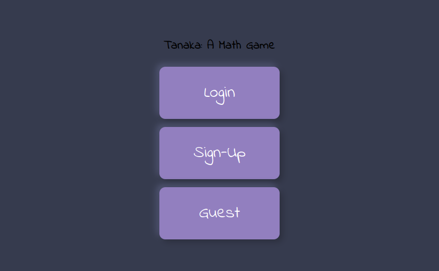
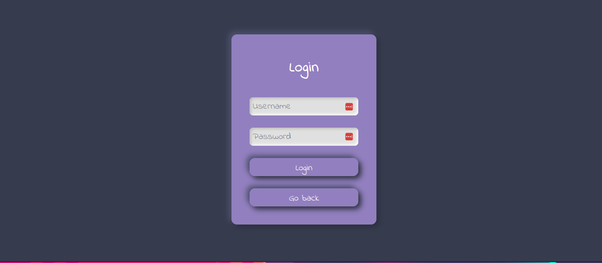
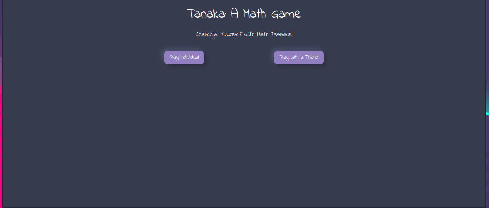
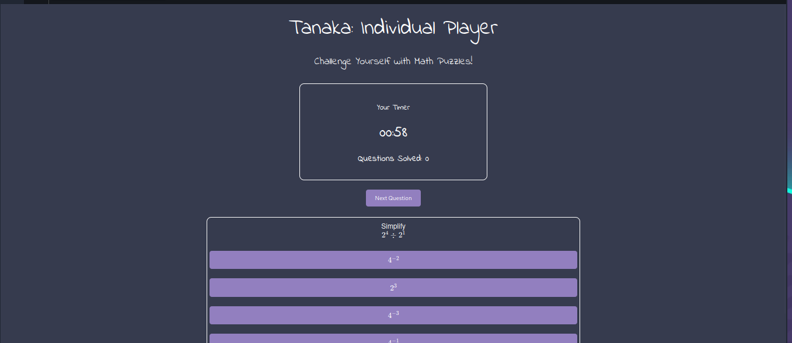
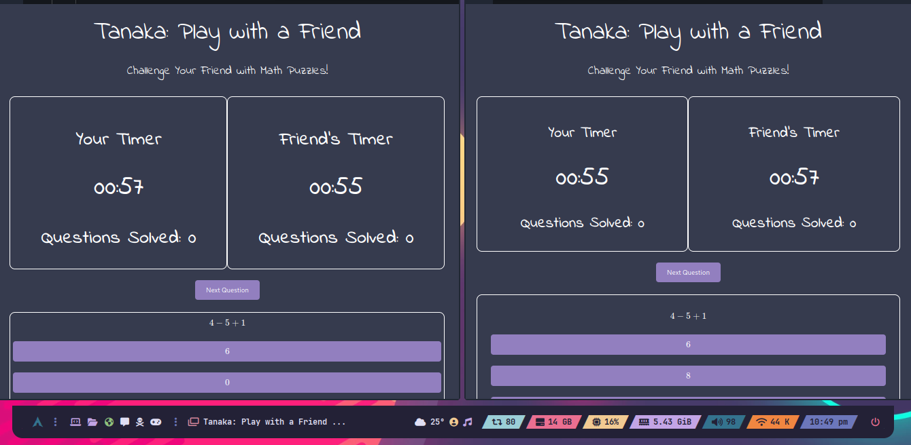
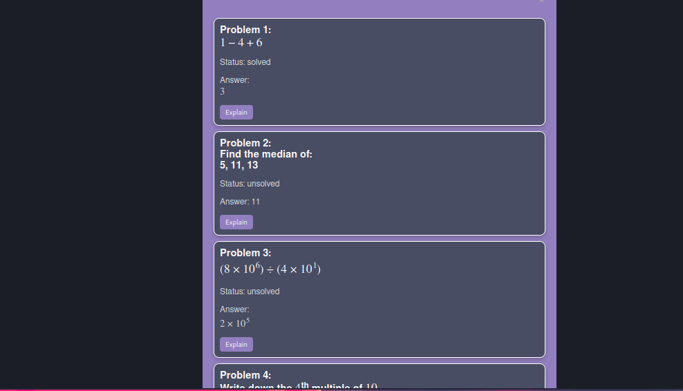
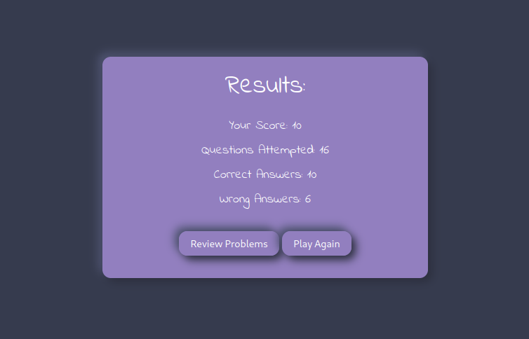
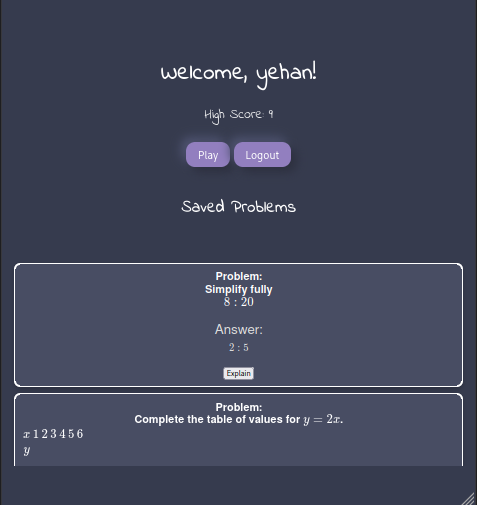

# Tanaka: A Math Game


See the demo here: [https://tanaka-eyxp.onrender.com](https://tanaka-eyxp.onrender.com)
**Note:** This is a hackathon project created for "Valentine Hacks by EduLearn".

## Table of Contents
- [Inspiration](#inspiration)
- [What it does](#what-it-does)
- [How we built it](#how-we-built-it)
- [Challenges we ran into](#challenges-we-ran-into)
- [Accomplishments that we're proud of](#accomplishments-that-were-proud-of)
- [What we learned](#what-we-learned)
- [What's next for Tanaka](#whats-next-for-tanaka)
- [Installation](#installation)
- [Usage](#usage)
- [Screenshots](#screenshots)
- [Demo Video](#demo-video)
- [License](#license)

## Inspiration
Our inspiration for "Tanaka: A Math Game" came from a desire to make learning math enjoyable and engaging. We noticed that while math can be challenging when presented as homework, it becomes much more fun when approached as a hobby or game. Inspired by the structure and competitiveness of chess, we aimed to create a math-based game that encourages friendly competition and learning through play.

## What it does
"Tanaka: A Math Game" offers two main game modes:
1. **Play Individual:** Players can select a timer and difficulty level, and answer multiple-choice math questions within the given time. They receive immediate feedback on their performance, including scores, correct and incorrect answers, and a review option with AI-generated explanations.
2. **Play with a Friend:** Players can challenge a friend to a math duel, sharing a link to join. Both players answer questions simultaneously, with real-time tracking of each other’s progress. The game concludes with a win, lose, or tie result based on their scores.

## How we built it
We built the backend using Flask and Flask-SocketIO for real-time multiplayer interactions. The frontend is developed with plain HTML, CSS, and JavaScript. We used the Gemini AI API to generate explanations for math problems and verify answers. For problem generation, we created a Python API that interacts with the mathsbot.com site to fetch math questions.

## Challenges we ran into
We encountered several challenges, including:
- Integrating real-time features with Flask-SocketIO to ensure smooth multiplayer gameplay.
- Handling various correct answer formats, such as algebraic expressions, which led us to use AI for validation.
- Ensuring a seamless user experience with a straightforward and responsive design.
- Coordinating effectively as a team, especially under the time constraints of a hackathon.

## Accomplishments that we're proud of
We are proud of:
- Successfully implementing real-time multiplayer functionality that allows players to compete against each other.
- Seamlessly integrating AI for answer validation and problem explanations, enhancing the educational value of the game.
- Creating an engaging and fun platform that combines learning with competition, encouraging users to improve their math skills.

## What we learned
Throughout this project, we learned:
- The importance of clear communication and teamwork, especially when working on different parts of the project simultaneously.
- How to integrate AI services to handle complex validation and explanation tasks.
- Techniques for managing real-time data with Flask-SocketIO and ensuring a smooth user experience.

## What's next for Tanaka
Looking ahead, we plan to:
- Implement a "Play Random" mode where players can be matched with random opponents, increasing the game's social aspect.
- Expand the range of math problems and integrate more advanced AI capabilities to generate custom problems.
- Add more features such as leaderboards, achievements, and personalized user dashboards to enhance engagement and track progress.
- Optimize the codebase, separate CSS and JS into their own files, and improve the overall user interface and experience.

## Installation
To set up the project locally, follow these steps (before going any further make sure you have Google's GEMINI API ready):

1. Clone the repository:

    ```bash
    git clone https://github.com/RezSat/tanaka.git
    cd tanaka
    ```
2. Once you in the folder create a new .env file and add the following:

    ```
    GEMINI_API_KEY = "Your Api Key here"
    ```

3. Create a virtual environment and activate it:

    ```bash
    python -m venv venv #use the relevant python command according to your system
    source venv/bin/activate  # On Windows, use `venv\Scripts\activate`
    ```
4. Install the dependencies:

    ```bash
    pip install -r requirements.txt
    ```
5. Set the `FLASK_APP` Environment Variable (Optional, you need this if only trying to use `flask run` as run command)

    Before you run your application, you need to set the `FLASK_APP` environment variable to point to your `wsgi.py` file. This tells Flask which application to run.

    In the terminal, you can set it like this:

    **On Unix or MacOS:**
    ```sh
    export FLASK_APP=wsgi.py
    export FLASK_ENV=development  # Optional: for enabling debug mode
    ```

    **On Windows:**
    ```sh
    set FLASK_APP=wsgi.py
    set FLASK_ENV=development  # Optional: for enabling debug mode
    ```

6. Run the application (see above (4) if you are going to use the first command here):

    ```bash
    flask run
    ```

    or 

    ```bash
    python wsgi.py #use the relevant python command according to your system
    ```

## Usage
1. Open your web browser and go to `http://127.0.0.1:10000/`. ( configure ports and all as necessary from the wsgi.py file)
2. Register or play as a guest.
3. Choose between "Play Individual" or "Play with a Friend".
4. Select your timer and difficulty level.
5. Start playing and enjoy the game!

## Screenshots











## Demo Video
[Watch the Demo Video](https://www.example.com/demo)


## License
See the [LICENSE](LICENSE) file for details.